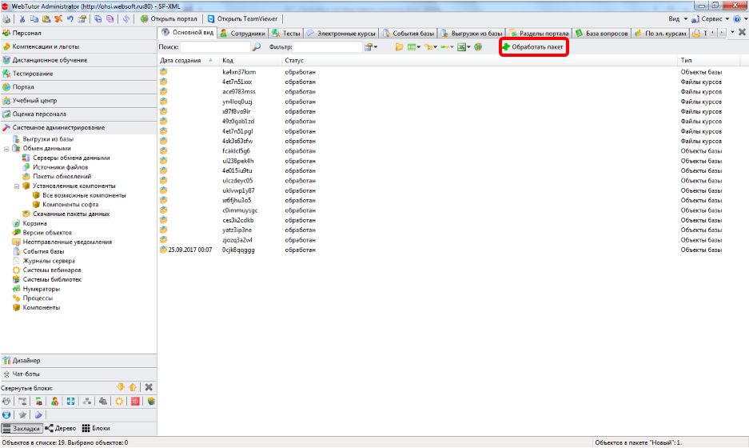

# Как загрузить пакет с агентом в систему
***

Для загрузки пакета с агентом выполните следующие действия:

* Скачайте файл пакета с агентом (такой файл обычно имеет расширение ZIP). 
* В программе WebTutor Administrator откройте раздел **Системное администрирование – Обмен данными – Скачанные пакеты данных**. 
* Нажмите кнопку **Обработать пакет**. 
* Укажите путь к скачанному файлу пакета с агентом.

 

***

<dd><li> <a href="README.md"> Возврат к оглавлению</a></dd>
