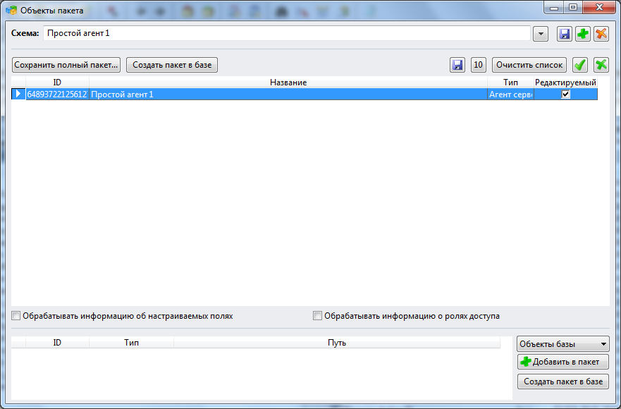

# 
Приложение 2. Как создать собственный пакет с агентом
***

Для создания собственного пакета (файла с расширением ZIP) выполните следующие действия:

* В списке агентов выделить нужную строку.
* Нажмите на правую кнопку мыши 
* Выберите команду **Добавить в пакет**.

Агент добавляется в пакет с именем "Новый".

* Выполните команду **Сервис - Содержимое пакета"".

Открывается окно "Объекты пакета":

* Нажмите кнопку **"Сохранить полный пакет"**.

В некоторых случаях при формировании пакета с агентом возникает ошибка:

В этом случае попробуйте установить флажок **Использовать альтернативный компонент ZIP** (**Сервис - Настройки пользователя - Дополнительно - Использовать альтернативный компонент ZIP**).


***

<dd><li> <a href="README.md"> Возврат к оглавлению</a></dd>
