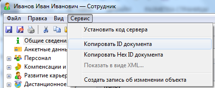

# Приложение 3. Как определить ID объекта
***

Для определения ID объекта выполните следующие действия:

* Откройте в Webtutor Administrator карточку объекта.
* Выполните команду меню карточки объекта **Сервис - Копировать ID документа**.
 

В результате ID объекта записывается в буфер обмена операционной системы.

* Вставьте ID объекта из буфера обмена в нужное место (в текстовый редактор, таблицу и т.д.).

***

<dd><li> <a href="README.md"> Возврат к оглавлению</a></dd>
