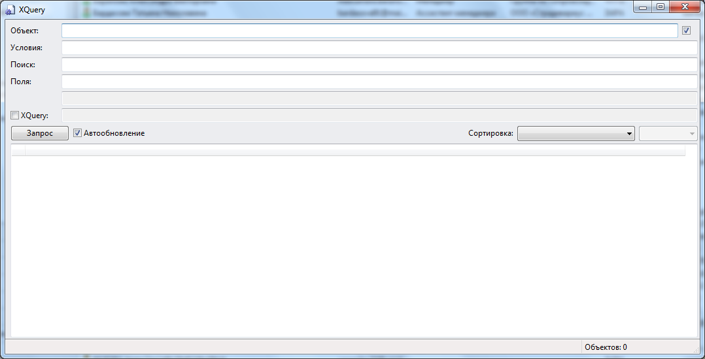

# Приложение 4. Как открыть окно просмотра каталога
***

Для включения режима просмотра каталога и открытия окна просмотра каталога нажмите комбинацию клавиш Ctrl+Shift+F8. 

Открывается интерфейс, позволяющий получить данные из каталога:

---

Для проверки корректности запросов в формате XQuery установите слева от поля **XQuery**, скопируйте текст запроса в поле **XQuery** и нажмите на кнопку **Запрос**:

***

<dd><li> <a href="README.md"> Возврат к оглавлению</a></dd>
