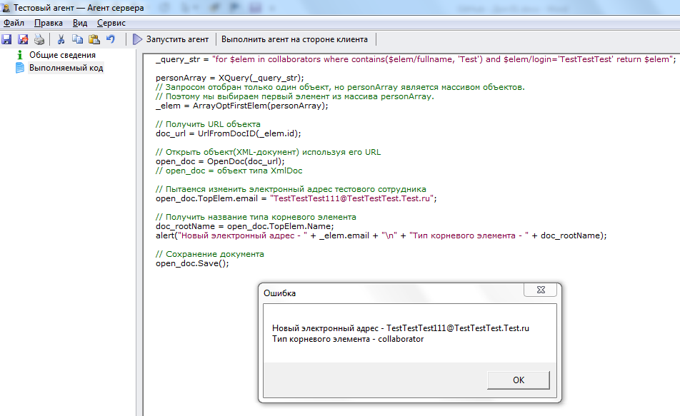

# Обращение к атрибутам объекта из документа. Функция TopElem
***

В предыдущем разделе [Изменение атрибутов объекта. Использование встроенного объекта Документ](XmlDoc.md) мы обращались из документа к атрибуту основного («корневого») объекта, указав его название типа этого объекта (например, **collaborator**): 

    open_doc.collaborator.email = "TestTestTest111@TestTestTest.Test.ru";

Однако, при программировании в системе WebTutor рекомендуется вместо имени корневого объекта использовать атрибут **TopElem**:

    open_doc.TopElem.email = "TestTestTest111@TestTestTest.Test.ru";

---

**TopElem** – это специальный атрибут объекта XmlDoc, возвращающий корневой объект документа. 

Проверим, как работает данный атрибут:

    _query_str = "for $elem in collaborators where contains($elem/fullname, 'Test') and $elem/login='TestTestTest' return $elem";
    
    personArray = XQuery(_query_str);
    // Запросом отобран только один объект, но personArray является массивом объектов.
    // Поэтому мы выбираем первый элемент из массива personArray.
    _elem = ArrayOptFirstElem(personArray);
    
   // Получить URL объекта 
    doc_url = UrlFromDocID(_elem.id);
    
    // Открыть объект(XML-документ) используя его URL
    open_doc = OpenDoc(doc_url);
    // open_doc = объект типа XmlDoc 
    
    // Пытаемся изменить электронный адрес тестового сотрудника
    open_doc.TopElem.email = "TestTestTest111@TestTestTest.Test.ru";
    
    // Получить название типа корневого элемента 
    doc_rootName = open_doc.TopElem.Name;
    alert("Новый электронный адрес - " + _elem.email + "\n" + "Тип корневого элемента - " + doc_rootName);
    
    // Сохранение документа
    open_doc.Save();

---

Результат работы агента:

После обновления с помощью клавиши **F5** на вкладке **Сотрудники** в Администраторе электронный адрес сотрудника изменяется.

***

<dd><li> <a href="5_document.md"> Возврат к части 5</a></dd>

<dd><li> <a href="README.md"> Возврат к оглавлению</a></dd>
