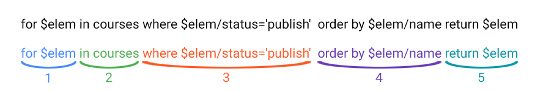

# Запросы XQuery. Примеры запросов

***

В системе WebTutor широко используются запросы в формате XQuery. Эти запросы менее известны, чем аналогичные запросы на языке SQL, но после некоторой практики запросы XQuery становятся вполне понятными.

Для понимания того, как устроены запросы XQuery, на наш взгляд, может быть полезна следующая прекрасная иллюстрация взята из книги Максима Юркова ["Progressive WebTutor"](https://maksimyurkov.gitbooks.io/progressive-webtutor/content/).

1.  for $elem  in collaborators  where contains($elem/fullname, 'Иванов')  order by $elem/id ascending  Объект в котором хранятся запрашиваемые записи
2. Название таблицы из которой берутся записи. Все записи созданы по одному шаблону, и могут содержать только те поля, которые содержатся в шаблоне.
3. Логическое условие
4. Сортировка записей
5. Результат запроса, объект с отфильтрованными записями

---

**Отбор сотрудников по одному критерию:**

for $elem in collaborators where contains($elem/fullname, 'Test') return $elem

 for $elem  in collaborators  where contains($elem/fullname, 'Test')  return $elem

* Аналогичный запрос на языке SQL:

SELECT * FROM collaborators WHERE CONTAINS(fullname, 'Test')

* Присвоение переменной текста запроса: 

_query_str = "for $elem in collaborators where contains($elem/fullname, 'Test') return $elem";

**Примечание**: Обратите внимание на то, что значение критерия поиска (ФИО) заключено в одинарные кавычки, а весь текст кода запроса – в двойные кавычки.

**CONTAINS** — предикат, используемый для выполнения полнотекстового поиска подстроки в полях, содержащих символьные данные.

---

**Отбор сотрудников по двум критериям:**

for $elem in collaborators where (contains($elem/fullname, 'Test') and $elem/login = 'TestTestTest') return $elem

 for $elem  in collaborators  where (contains($elem/fullname, 'Test') and $elem/login = 'TestTestTest')  return $elem

* Аналогичный запрос на языке SQL:

SELECT * FROM collaborators WHERE CONTAINS(fullname, 'Test') AND login = 'TestTestTest'

* Присвоение переменной текста запроса: 

_query_str = "for $elem in collaborators where (contains($elem/fullname, 'Test') and $elem/login = 'TestTestTest') return $elem";

---

**Отбор теста по одному критерию (коду):**

for $elem in assessments where $elem/code = '00000017' return $elem 

 for $elem  in assessments  where $elem/code = '00000017'  return $elem

* Аналогичный запрос на языке SQL:

SELECT * FROM assessments WHERE code = '00000017'

* Присвоение переменной текста запроса: 

_query_str = " for $elem in assessments where $elem/code = '00000017' return $elem ";

---

**Отбор курса по одному критерию (коду):**

for $elem in courses where $elem/code = 'OTM8' return $elem

 for $elem  in courses  where $elem/code = 'OTM8'  return $elem

* Аналогичный запрос на языке SQL:

SELECT * FROM courses WHERE code = 'OTM8'

* Присвоение переменной текста запроса: 

_query_str = "for $elem in courses where $elem/code = 'OTM8' return $elem";

---

**Отбор объекта по ID:**

for $elem in collaborators where $elem/id = 6511610587817075498 return $elem

for $elem in assessments where $elem/id = 6424083603832075130 return $elem

for $elem in courses where $elem/id = 6486395195918459516 return $elem

 for $elem  in collaborators  where $elem/id = 6511610587817075498  return $elem

 for $elem  in assessments  where $elem/id = 6424083603832075130  return $elem

 for $elem  in courses  where $elem/id = 6486395195918459516  return $elem

**Примечание** – Об определении ID объектов – см. [Приложение 3. Как определить ID объекта](3_pril.md).

---

**Отбор сотрудников с упорядочиванием (по возрастанию):**

for $elem in collaborators where contains($elem/fullname, 'Иванов') order by $elem/id return $elem

или 

for $elem in collaborators where contains($elem/fullname, 'Иванов') order by $elem/id ascending return $elem

 for $elem  in collaborators  where contains($elem/fullname, 'Иванов')  order by $elem/id  return $elem

 for $elem  in collaborators  where contains($elem/fullname, 'Иванов')  order by $elem/id ascending  return $elem

* Аналогичный запрос на языке SQL:

SELECT * FROM collaborators WHERE CONTAINS(fullname, 'Иванов') ORDER BY id 

* Присвоение переменной текста запроса: 

_query_str = "for $elem in collaborators where contains($elem/fullname, 'Иванов') order by $elem/id return $elem";

----

**Отбор сотрудников с упорядочиванием (по убыванию):**

for $elem in collaborators where contains($elem/fullname, 'Иванов') order by $elem/id descending return $elem

 for $elem  in collaborators  where contains($elem/fullname, 'Иванов')  order by $elem/id descending  return $elem

* Аналогичный запрос на языке SQL:

SELECT * FROM collaborators WHERE CONTAINS(fullname, 'Иванов') ORDER BY id DESC

* Присвоение переменной текста запроса: 

_query_str = "for $elem in collaborators where contains($elem/fullname, 'Иванов') order by $elem/id descending return $elem";

---

**Отбор законченных тестов для определенного сотрудника:**

for $emp in test_learnings where contains($emp/person_fullname, 'Иванов Иван Иванович') return $emp

 for $emp  in test_learnings  where contains($emp/person_fullname, 'Иванов Иван Иванович')  return $emp

* Присвоение переменной текста запроса: 

_query_str = "for $emp in test_learnings where contains($emp/person_fullname, 'Иванов Иван Иванович') return $emp";

---

**Отбор незаконченных тестов для определенного сотрудника:**

for $emp in active_test_learnings where contains($emp/person_fullname, 'Иванов Иван Иванович') return $emp

 for $emp  in active_test_learnings  where contains($emp/person_fullname, 'Иванов Иван Иванович')  return $emp

* Присвоение переменной текста запроса: 

_query_str = "for $emp in active_test_learnings where contains($emp/person_fullname, 'Иванов Иван Иванович') return $emp";

---

**Отбор пройденных тестов (state_id=4) среди завершенных по данному сотруднику:**

for $elem in collaborators where contains($elem/fullname, 'Иванов') and $elem/state_id=4 return $elem

 for $elem  in collaborators  where contains($elem/fullname, 'Иванов') and $elem/state_id=4  return $elem

* Присвоение переменной текста запроса: 

_query_str = "for $elem in collaborators where contains($elem/fullname, 'Иванов') and $elem/state_id=4 return $elem";

---

**Отбор пройденных тестов (state_id=4) среди незавершенных по данному сотруднику:**

for $elem in collaborators where contains($elem/fullname, 'Иванов') and $elem/state_id=4 return $elem

 for $elem  in collaborators  where contains($elem/fullname, 'Иванов') and $elem/state_id=4  return $elem

* Присвоение переменной текста запроса: 

_query_str = "for $elem in collaborators where contains($elem/fullname, 'Иванов') and $elem/state_id=4 return $elem";

---

* Откройте окно просмотра каталога Ctrl+Shift+F8 (см. [Приложение 4. Как открыть окно просмотра каталога](4_pril.md)). 
* Скопируйте тексты запросов в поле **XQuery** и выполните запросы.

**Внести изменения!** - Обратите внимание, что в Вашей системе будут иные коды курсов и тестов, иные идентификационные номера ID, а также может не быть сотрудника с именем 'Иванов Иван Иванович'. Внесите в приведенные выше тесты запросов изменения, в соответствии с особенностями Вашей системы. 

***
<dd><li> <a href="4_queries.md"> Возврат к части 4</a></dd>
<dd><li> <a href="README.md"> Возврат к оглавлению</a></dd>
