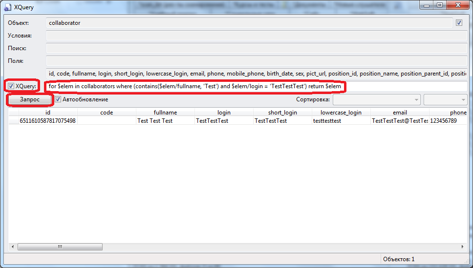

# Тестирование запроса в режиме просмотра каталога
***

Откройте окно просмотра каталога, как это описано в разделе [Приложение 4. Как открыть окно просмотра каталога](4_pril.md).

Для проверки корректности запросов в формате XQuery установите флажок слева от поля **XQuery**, скопируйте текст запроса в поле **XQuery** и нажмите на кнопку **Запрос**:

В нижней части окна выводятся объекты системы, отобранные в результате выполнения запроса.

В случае, если найден искомый объект, - запрос можно далее использовать в работе агента.

В случае, если не найдено ни одного объекта, - скорее всего запрос был составлен не вполне корректно и его нужно изменить.

В случае, если найден объект, отличающийся от искомого, - запрос также нужно изменить.

В случае, если найдено несколько объектов, - необходимо задуматься о способах обработки всех найденных объектов или скорректировать текст запроса, чтобы уточнить результаты запроса.

***
<dd><li> <a href="4_queries.md"> Возврат к части 4</a></dd>
<dd><li> <a href="README.md"> Возврат к оглавлению</a></dd>
