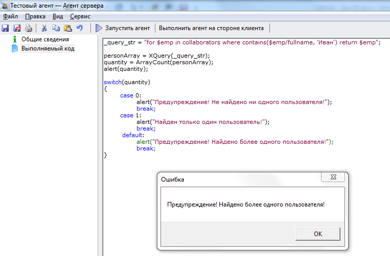

# Определение количества объектов, полученных в результате запроса
***

Составьте запрос, позволяющий отобрать несколько объектов. Для нашей базы я использовал следующий запрос:

**for $elem in collaborators where contains($elem/fullname, 'Иван') return $elem**

Проверьте запрос в режиме просмотра каталога, как это описано в разделе [Тестирование запроса в режиме просмотра каталога](XQuery_control.md).

В нашей базе в результате выполнения этого запроса было отобрано 80 объектов (80 сотрудников).

Выведем программным способом количество отобранных объектов.

Результатом отбора объектов по запросу является массив объектов.

Для определения количества элементов массива используется команда:
**ArrayCount(НаименованиеМассива)**

---

Скопируйте приведенный код в созданный нами агент **Тестовый агент** на вкладку **"Выполняемый код"** (предыдущий код, введенный ранее на эту вкладку, можно удалить) и запустите агент, нажав на кнопку **Выполнить агент на стороне клиента**.

    _query_str = "for $emp in collaborators where contains($emp/fullname, 'Иван') return $emp";
    
    personArray = XQuery(_query_str);
    quantity = ArrayCount(personArray);
    alert(quantity); 
    
    switch(quantity)
    {
    	case 0:
    		alert("Предупреждение! Не найдено ни одного пользователя!");
    		break;
    	case 1:
    		alert("Найден только один пользователь!");
    		break;
    	default:
    		alert("Предупреждение! Найдено более одного пользователя!");
    		break;
    }

---

Результат выполнения агента:

---

Для лучшего усвоения материала измените код и понаблюдайте, как это повлияло на полученный результат.

***

<dd><li> <a href="5_practical_realization.md"> Возврат к части 5</a></dd>
<dd><li> <a href="README.md"> Возврат к оглавлению</a></dd>
