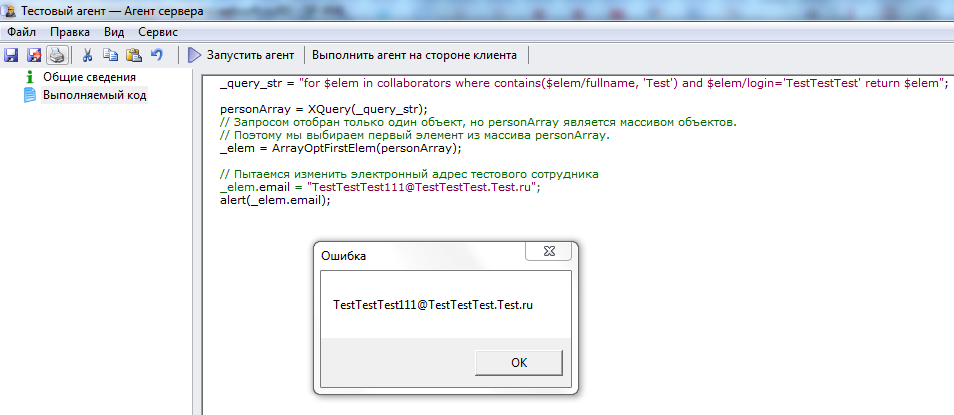
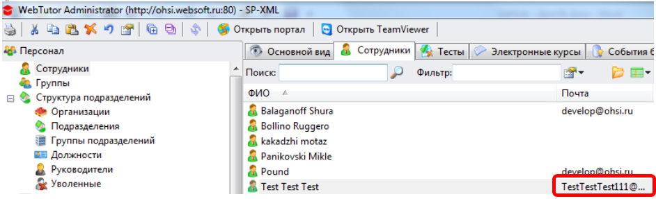

# Изменение атрибутов объекта. Использование встроенного объекта Документ
***

Попробуем программно изменить фамилию тестового сотрудника.

**Внимание**. Данное упражнение производит изменение в рабочей базе. Проверьте, что производится изменение данных только тестового пользователя.

    _query_str = "for $elem in collaborators where contains($elem/fullname, 'Test') and $elem/login='TestTestTest' return $elem";
    
    personArray = XQuery(_query_str);
    // Запросом отобран только один объект, но personArray является массивом объектов.
    // Поэтому мы выбираем первый элемент из массива personArray.
    _elem = ArrayOptFirstElem(personArray);
    
    // Пытаемся изменить электронный адрес тестового сотрудника
    _elem.email = "TestTestTest111@TestTestTest.Test.ru";
    alert(_elem.email);

 

Мы видим, что в процессе выполнения данного агента значение атрибута изменилось, но, если мы откроем карточку объекта, то мы увидим, что внесенное изменение в карточке не сохранилось.

**Примечание** - Документы также широко используются при разработке шаблонов уведомлений и др. элементов системы WebTutor.

Для того, чтобы иметь возможность вносить реальные изменения в значения атрибутов объекта, используется встроенный объект **XmlDoc** (**Документ**) (Об атрибутах и методах этого объекта – см. [http://docs.datex.ru/article.htm?id=5620203358492510980](http://docs.datex.ru/article.htm?id=5620203358492510980) ).

Приведем простой пример работы с документом для изменения значения атрибута объекта **collaborator**.

    _query_str = "for $elem in collaborators where contains($elem/fullname, 'Test') and $elem/login='TestTestTest' return $elem";
    
    personArray = XQuery(_query_str);
    // Запросом отобран только один объект, но personArray является массивом объектов.
    // Поэтому мы выбираем первый элемент из массива personArray.
    _elem = ArrayOptFirstElem(personArray);
    
    alert(_elem.id);
    
   // Получить URL объекта 
    doc_url = UrlFromDocID(_elem.id);
    
    // Открыть объект(XML-документ) используя его URL
    open_doc = OpenDoc(doc_url);
    // open_doc = объект типа XmlDoc 
    
    // Пытаемся изменить электронный адрес тестового сотрудника
    open_doc.collaborator.email = "TestTestTest111@TestTestTest.Test.ru";
    
    // Сохранить документ
    open_doc.Save();
    
    alert(_elem.email);

Теперь, если мы откроем в Администраторе системы вкладку **Сотрудники** и обновим данные клавишей **F5**. Видим, что электронный адрес в системе изменился:

 

---

После выполнения данного упражнения восстановите исходный электронный адрес сотрудника в Администраторе системы.

***

<dd><li> <a href="5_document.md"> Возврат к части 5</a></dd>

<dd><li> <a href="README.md"> Возврат к оглавлению</a></dd>
