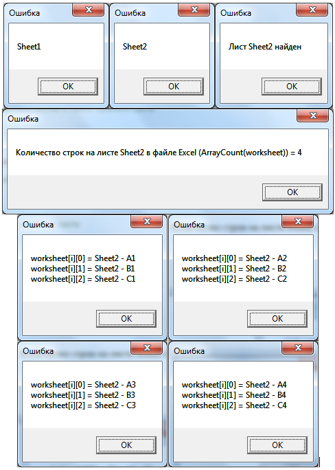

# Чтение данных из файла Excel
***

Чтение данных из файла Excel - очень полезная процедура, позволяющая быстро ввести исходные данные в систему. В настоящем разделе рассмотрим подробно процесс загрузки данных из файла Excel в систему WebTutor.

Импортированные данные из Excel представляют собой трехмерный массив (первый индекс - листы, второй индекс - столбцы, третий - строки). В свою очередь, данные каждого листа представляют собой двумерный массив (первый индекс - столбцы, второй индекс - строки). Соотношение книги, листов и ячеек Excel продемонстрировано на следующей схеме: 

Предварительно скачайте [файл Excel](Excel-TestFile01.xlsx) для загрузки.

Скопируйте приведенный код в созданный нами агент **Тестовый агент** на вкладку **"Выполняемый код"** (предыдущий код, введенный ранее на эту вкладку, можно удалить) и запустите агент, нажав на кнопку **Выполнить агент на стороне клиента**.

После запуска программы загрузите скачанный ранее файл **Excel-TestFile01.xlsx**.

...

---

Результат выполнения агента:

Внесите изменения в программу и в загружаемый файл Excel и понаблюдайте, как это повлияет на полученный результат.

***

<dd><li> <a href="5_practical_realization.md"> Возврат к части 5</a></dd>

<dd><li> <a href="README.md"> Возврат к оглавлению</a></dd>
