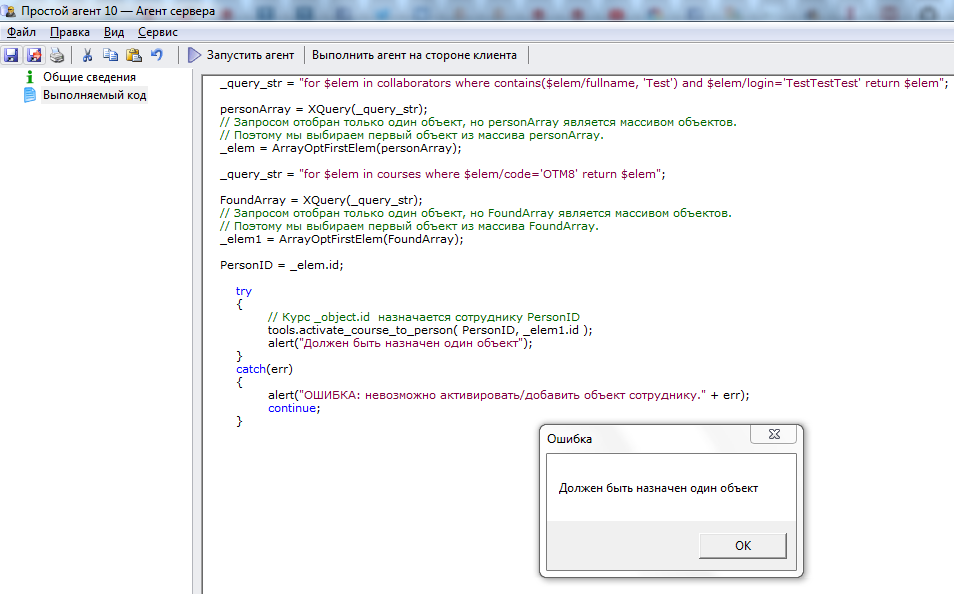

# Назначение курса сотруднику
***

Для назначения сотруднику курса используется функция: 
tools.activate_course_to_person( PersonID, _object.id );

---

Скопируйте приведенный код в созданный нами агент **Тестовый агент** на вкладку **"Выполняемый код"** (предыдущий код, введенный ранее на эту вкладку, можно удалить) и запустите агент, нажав на кнопку **Выполнить агент на стороне клиента**.

    // Выполняем отбор сотрудника
    _query_str = "for $elem in collaborators where contains($elem/fullname, 'Test') and $elem/login='TestTestTest' return $elem";
    
    personArray = XQuery(_query_str);
    // Запросом отобран только один объект, но personArray является массивом объектов.
    // Поэтому мы выбираем первый объект из массива personArray.
    _elem = ArrayOptFirstElem(personArray);

    // Выполняем отбор курса
    _query_str = "for $elem in courses where $elem/code='OTM8' return $elem";
    
    FoundArray = XQuery(_query_str);
    // Запросом отобран только один объект, но FoundArray является массивом объектов.
    // Поэтому мы выбираем первый объект из массива FoundArray.
    _elem1 = ArrayOptFirstElem(FoundArray);
    
    PersonID = _elem.id;
    
    try
    {
    	// Курс _object.id  назначается сотруднику PersonID
    	tools.activate_course_to_person( PersonID, _elem1.id );
    	alert("Должен быть назначен один объект");
    }
    catch(err)
    {
    	alert("ОШИБКА: невозможно активировать/добавить объект сотруднику." + err);
    	continue;
    }

 **Внести изменения!** Обратите внимание, что в данный запрос нужно вставить код реального курса из Вашей базы (код курса можно найти на карточке курса, на вкладке **Общие сведения** в поле **Код**).

---

Результат выполнения агента:

---

Проверьте, что сотруднику с именем 'Test Test Test' назначен указанный Вами курс.

Для лучшего усвоения материала измените код и понаблюдайте, как это повлияло на полученный результат.

***

<dd><li> <a href="6_practical_realization.md"> Возврат к части 6</a></dd>

<dd><li> <a href="README.md"> Возврат к оглавлению</a></dd>
