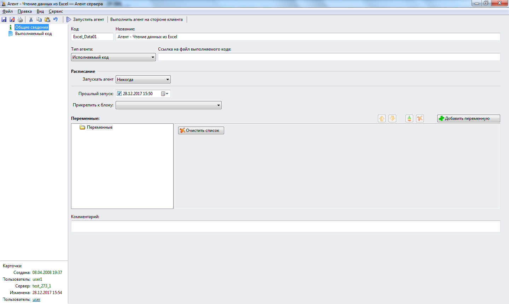

# Что такое агент? 
***

Пользовательские программы в среде WebTutor называются **агентами**. Программирование в среде WebTutor производится, в основном, с помощью соответствующих агентов.

Агенты в системе размещаются в WebTutor Administrator в разделе **Дизайнер - Агенты сервера**.

---

Откройте в WebTutor Administrator раздел **Агенты сервера**.

В этом разделе обычно уже имеются некоторые агенты, предоставленные компанией WebSoft.

Откройте карточку какого-нибудь агента и посмотите, как устроена карточка.

На карточке размещены 2 вкладки - **"Общие сведения"** и **"Выполняемый код"**.

На вкладке **"Общие сведения"** можно увидеть **Код** агента и его **Название**. Может быть также установлена ссылка на файл выполняемого кода, расписание запуска агента, переменные, используемые в процессе работы агента, и др.

На вкладке **"Выполняемый код"** размещается код, выполняемый агентом. Если была указана ссылка на файл выполняемого кода, то вкладка **"Выполняемый код"** может оставаться пустой.

В процессе работы с данным практикумом мы будем записывать выполняемый код на вкладке **"Выполняемый код"**. 

***

<dd><li> <a href="README.md"> Возврат к оглавлению</a></dd>
