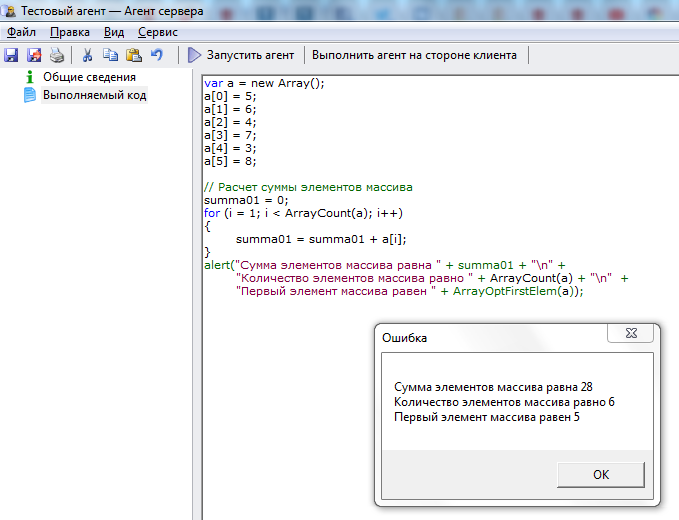
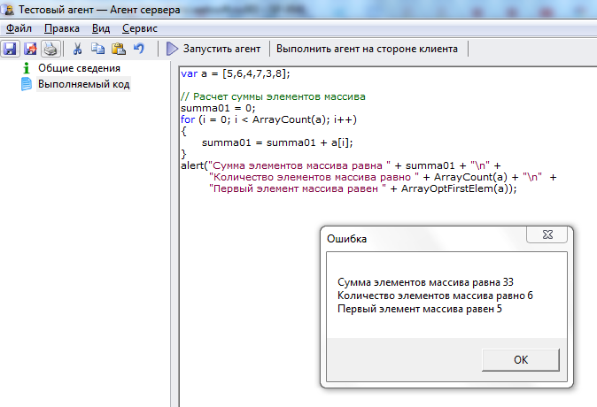
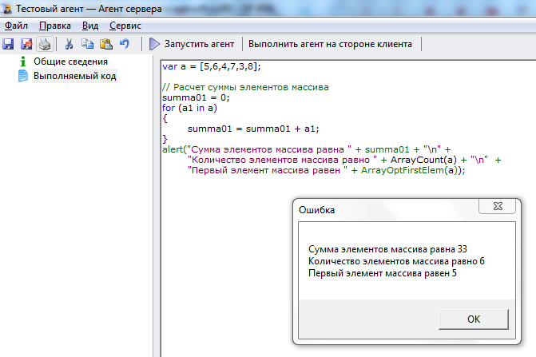
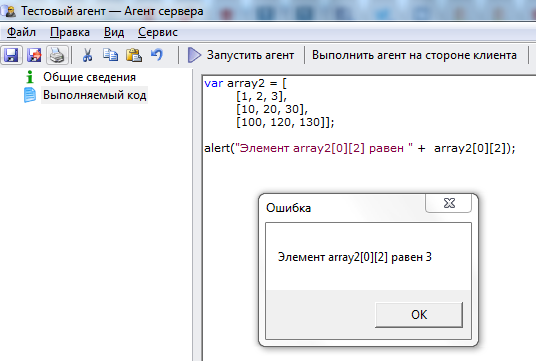

# Массивы
***

## Объявление массива

Массивы в системе WebTutor в общем случае требуют объявления:

    // одномерный массив
    var array1 = new Array();
    или
    var array1 = [5,6,4,7,3,8];

    // двумерный массив
    var array2 = [
    	[1, 2, 3],
    	[10, 20, 30],
    	[100, 120, 130]];

Обращение к элементам массива имеет следующий вид:

    // одномерный массив
    array1[0]

    // двумерный массив
    array2[0][2]

Нумерация членов массива начинается с 0.

Для работы с массивами используются встроенные функции. В системе WebTutor часто встречаются следующие встроенные функции:

**ArrayCount(НаименованиеМассива)** - возвращает количество элементов массива.

**ArrayOptFirstElem(НаименованиеМассива)** - возвращает первый элемент заданного массива.

---

К массивам применима конструкция цикла **for... in**.

---

Примеры:

    var a = new Array();
    a[0] = 5;
    a[1] = 6;
    a[2] = 4;
    a[3] = 7;
    a[4] = 3;
    a[5] = 8;
    
    // Расчет суммы элементов массива
    summa01 = 0;
    for (i = 0; i < ArrayCount(a); i++)
    {
        summa01 = summa01 + a[i];
    } 
    alert("Сумма элементов массива равна " + summa01 + "\n" + 
        "Количество элементов массива равно " + ArrayCount(a) + "\n"  + 
        "Первый элемент массива равен " + ArrayOptFirstElem(a));

---

Результат выполнения агента:

Изменяйте значения элементов массива и понаблюдайте, как это влияет на полученный результат.

---

    var a = [5,6,4,7,3,8];

    // Расчет суммы элементов массива
    summa01 = 0;
    for (i = 0; i < ArrayCount(a); i++)
    {
	      summa01 = summa01 + a[i];
    } 
    alert("Сумма элементов массива равна " + summa01 + "\n" + 
        "Количество элементов массива равно " + ArrayCount(a) + "\n"  + 
        "Первый элемент массива равен " + ArrayOptFirstElem(a));

---

Результат выполнения агента:

Изменяйте значения элементов массива и понаблюдайте, как это влияет на полученный результат.

---

## Обход массива с помощью цикла for... in

    var a = [5,6,4,7,3,8];

    // Расчет суммы элементов массива
    summa01 = 0;
    for (a1 in a)
    {
     	summa01 = summa01 + a1;
    } 
    alert("Сумма элементов массива равна " + summa01 + "\n" + 
	"Количество элементов массива равно " + ArrayCount(a) + "\n"  + 
	"Первый элемент массива равен " + ArrayOptFirstElem(a));

---

Результат выполнения агента:

Изменяйте значения элементов массива и понаблюдайте, как это влияет на полученный результат.

---

## Работа с двумерным массивом

    var array2 = [
    	[1, 2, 3],
    	[10, 20, 30],
    	[100, 120, 130]];

    alert("Элемент array2[0][2] равен " +  array2[0][2]);

---

Результат выполнения агента:

Изменяйте значения элементов массива и понаблюдайте, как это влияет на полученный результат.

***
<dd><li> <a href="1_language.md"> Возврат к части 1</a></dd>
<dd><li> <a href="README.md"> Возврат к оглавлению</a></dd>
