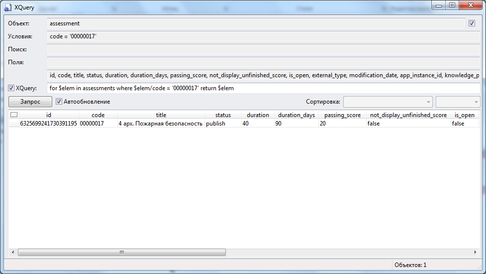
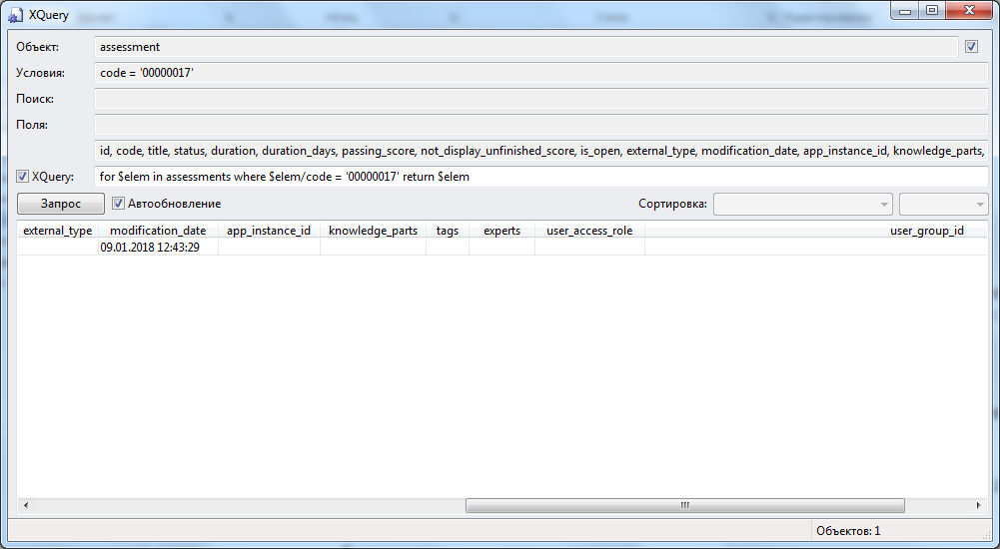

# Разбор объектной модели assessment (Тест) в режиме просмотра каталога 
***

---

Нажимаем ctrl + shift + f8. Получаем интерфейс, позволяющий получить данные из каталога.

for $elem in assessments where $elem/code = '00000017' return $elem

 

 

id = '6325699241730391195'
code = '00000017'
title = '4 арх. Пожарная безопасность'
status = 'publish'
duration = 40
duration_days = 90
passing_score = 20
not_display_unfinished_score = false
is_open = false
external_type – атрибут неопределен
modification_date = '09.01.2018 12:43:29'
app_instance_id – атрибут неопределен
knowledge_parts – атрибут неопределен
tags – атрибут неопределен
experts – атрибут неопределен
user_access_role – атрибут неопределен
user_group_id – атрибут неопределен

***
<dd><li> <a href="3_object_model.md"> Возврат к части 3</a></dd>
<dd><li> <a href="README.md"> Возврат к оглавлению</a></dd>
