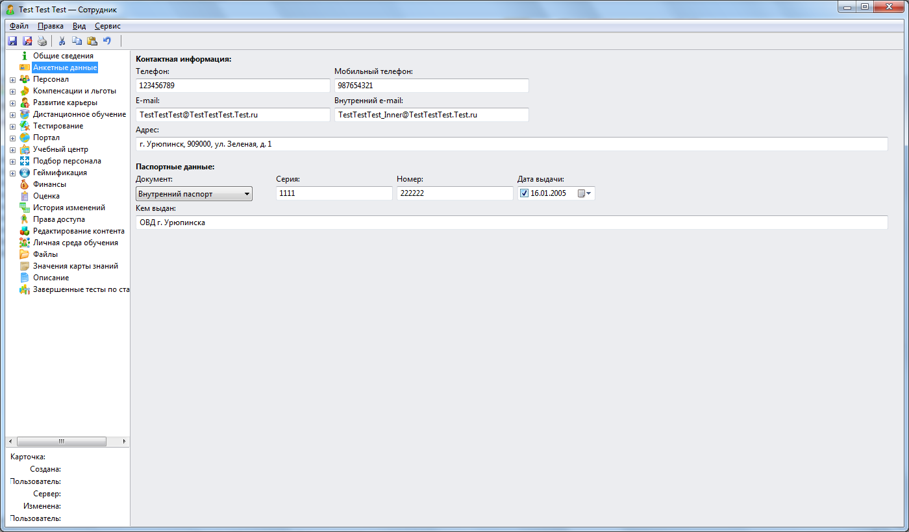
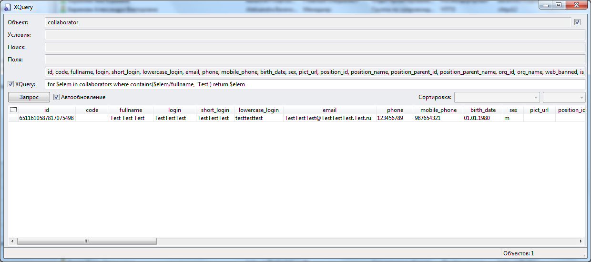
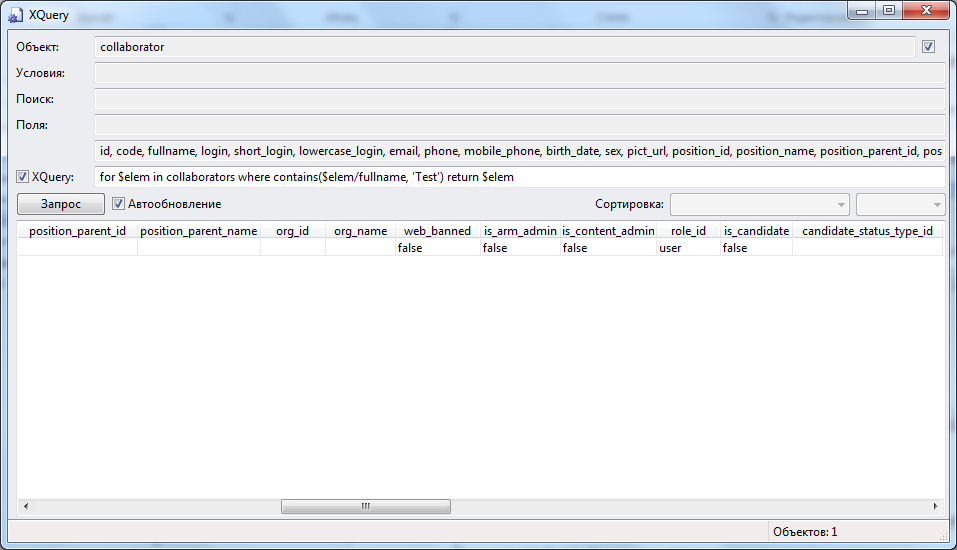
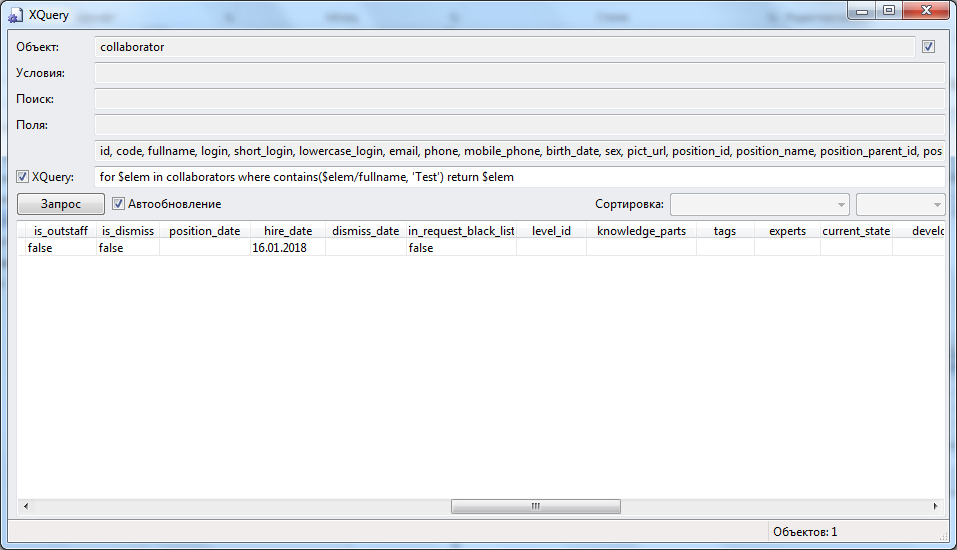
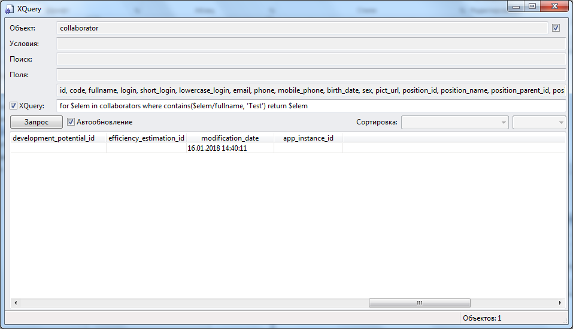

# Разбор объектной модели collaborator (Сотрудник) в режиме просмотра каталога 
***

Нажимаем Ctrl + Shift + F8. Получаем интерфейс, позволяющий получить данные из каталога.

Даходим тестового пользователя:
for $elem in collaborators where contains($elem/fullname, 'Test') return $elem

 

**id** = 6511610587817075498

**code** – атрибут неопределен

**fullname** = 'Test Test Test'

**login** = 'TestTestTest'

**short_login** = 'TestTestTest'

**lowercase_login** = 'testtesttest'

**email** = 'TestTestTest@TestTestTest.Test.ru'

**phone** = '123456789'

**mobile_phone** = '987654321'

**birth_date** = '01.01.1980'

**sex** = 'm'

**pict_url** – атрибут неопределен

**position_id** – атрибут неопределен

**position_name** – атрибут неопределен

**position_parent_id** – атрибут неопределен

**position_parent_name** – атрибут неопределен

**org_id** – атрибут неопределен

**org_name** – атрибут неопределен

**web_banned** = false

**is_arm_admin** = false

**is_content_admin** = false

**role_id** = 'user'

**is_candidate** = false

**candidate_status_type_id** – атрибут неопределен

**is_outstaff** = false

**is_dismiss** = false

**position_date** – атрибут неопределен

**hire_date** = '16.01.2018'

**dismiss_date** – атрибут неопределен

**in_request_black_list** = false

**level_id** – атрибут неопределен

**knowledge_parts** – атрибут неопределен

**tags** – атрибут неопределен

**experts** – атрибут неопределен

**current_state** – атрибут неопределен

**development_potential_id** – атрибут неопределен

**efficiency_estimation_id** – атрибут неопределен

**modification_date** = '16.01.2018 14:40:11'

**app_instance_id** – атрибут неопределен

**category_id** – атрибут неопределен

***
<dd><li> <a href="3_object_model.md"> Возврат к части 3</a></dd>
<dd><li> <a href="README.md"> Возврат к оглавлению</a></dd>
