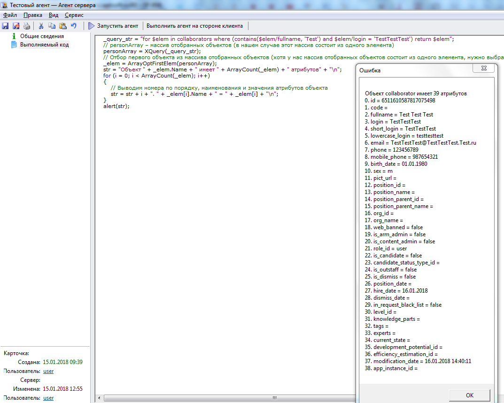

# Разбор объектной модели collaborator (Сотрудник) программным методом 
***

---

Просмотр атрибутов объекта программно:

    _query_str = "for $elem in collaborators where (contains($elem/fullname, 'Test') and $elem/login = 'TestTestTest') return $elem";
    // personArray – массив отобранных объектов (в нашем случае этот массив состоит из одного элемента)
    personArray = XQuery(_query_str);
    // Отбор первого объекта из массива отобранных объектов (хотя у нас массив отобранных объектов состоит из одного элемента, нужно выбрать один (в данном случае) первый элемент (объект))
    _elem = ArrayOptFirstElem(personArray);
    str = "Объект " + _elem.Name + " имеет " + ArrayCount(_elem) + " атрибутов" + "\n";
    for (i = 0; i < ArrayCount(_elem); i++)
    {
        // Выводим номера по порядку, наименования и значения атрибутов объекта 
        str = str + i + ". " + _elem[i].Name + " = " + _elem[i] + "\n";
    } 
    alert(str);

***
<dd><li> <a href="3_object_model.md"> Возврат к части 3</a></dd>
<dd><li> <a href="README.md"> Возврат к оглавлению</a></dd>
