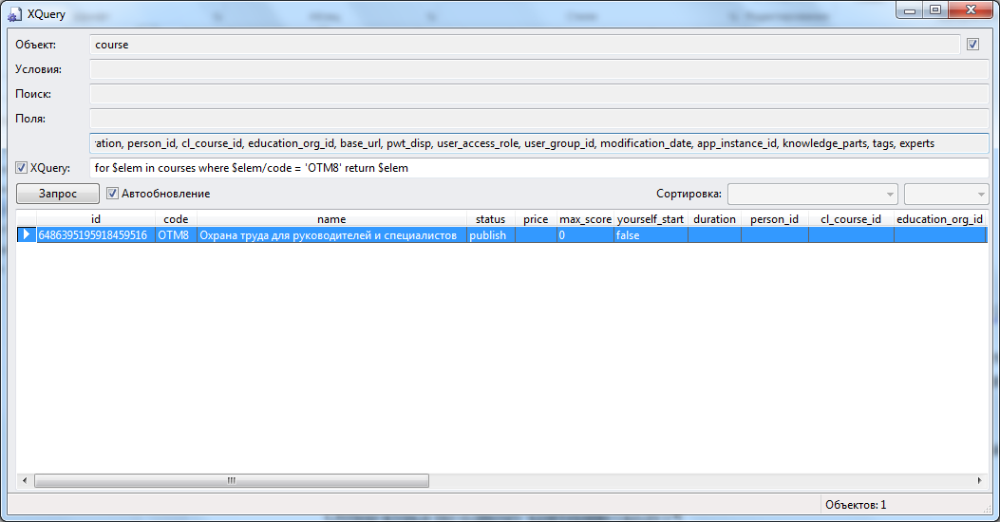
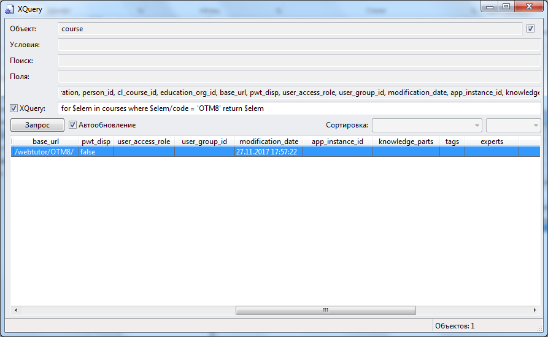

# Разбор объектной модели course (Электронный курс) в режиме просмотра каталога 
***

---

Нажимаем **Ctrl+Shift+F8** и в открывшемся окне просмотра каталога вводим текст запроса - отбор курса по коду:

**for $elem in courses where $elem/code = 'OTM8' return $elem**

---

Находим искомый курс. 

На следующих скриншотах показаны значения всех полей (атрибутов) объекта **course**:

 

 

id = '6486395195918459516'
code = 'OTM8'
name = 'Охрана труда для руководителей и специалистов'
status = 'publish'
price – атрибут неопределен
max_score = '0'
yourself_start = false
duration – атрибут неопределен
person_id – атрибут неопределен
cl_course_id – атрибут неопределен
education_org_id – атрибут неопределен
base_url = '/webtutor/OTM8/'
pwt_disp = false
user_access_role – атрибут неопределен
user_group_id – атрибут неопределен
modification_date = '27.11.2017 17:57:22'
app_instance_id – атрибут неопределен
knowledge_parts – атрибут неопределен
tags – атрибут неопределен
experts – атрибут неопределен

***
<dd><li> <a href="3_object_model.md"> Возврат к части 3</a></dd>
<dd><li> <a href="README.md"> Возврат к оглавлению</a></dd>
