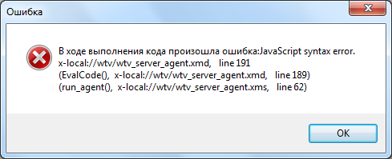

# Ошибки на этапе, предшествующем выполнению программы
***

**В ходе выполнения кода произошла ошибка: JavaScript error (Синтаксическая ошибка JavaScript)**

В случае появления данной ошибки программа не выполняется вообще. При ряде других ошибок программа выполняется до того места, где имеет место ошибка.

Возможные причины ошибки:
* Отсутствие скобки или наличие лишней скобки в операторе.
* Некорректный формат параметра (например, неправильный ID объекта, включающий в себя буквы).
* Некорректный текст в программе.

 

***

<dd><li> <a href="pril_errors.md"> Возврат к разделу "Основные сообщения об ошибках"</a></dd>

<dd><li> <a href="README.md"> Возврат к оглавлению</a></dd>
