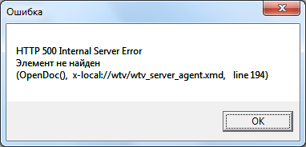
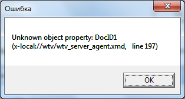
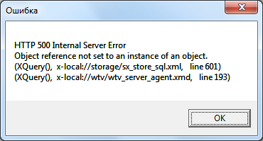
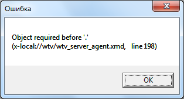
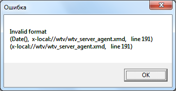
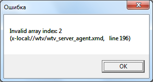
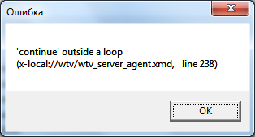
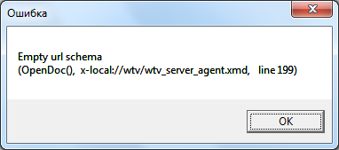
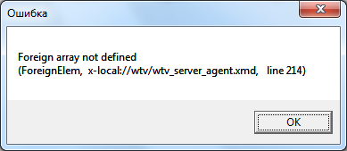

# Ошибки на этапе выполнения программы
***

## HTTP 500 Internal Server Error: Элемент не найден

 

Возможные причины:
* Некорректный цифровой ID при открытии объекта (XML-документа) по URL

---

## Unknown object property (Некорректный параметр (атрибут) объекта)

 

В сообщении указывается, какой именно параметр является некорректным.

Возможные причины:
* Указанный атрибут у данного объекта не существует.
* Объект, вызывающий атрибут, отсутствует (например, не был отобран запросом).

Некорректный параметр объекта (на 5 строк ниже предыдущего)
 

--- 

## … not defined (идентификатор не определен)

 

В сообщении указывается, какой именно идентификатор не определен.

Возможная причина:
* Использование некорректного оператора, некорректного имени объекта или некорректной функции. 

Примеры:

    allert("Привет!");
    prompt(a);

---

## HTTP 500 Internal Server Error: Object reference not set to an instance of an object (HTTP 500 (Внутренняя ошибка сервера): ссылка на объект не указывает на экземпляр объекта)

 

Возможная причина ошибки:
* Отсутствие скобки или наличие лишней скобки в тексте запроса.
* Другая ошибка в формировании запроса.

---

## Object required before '.' (Объект перед точкой отсутствует)

 

Данная ошибка возникает при попытке обратиться к атрибуту объекта (через точку), хотя объект не был найден.

Обработка ошибки возвращения пустого результата запроса может быть произведена следующим образом:

    FoundArray = XQuery(_query_str);
    _elem = ArrayOptFirstElem(FoundArray);
    if (_elem == undefined)
    {
    	alert("Ошибка: объект не найден.");
    	// Завершение итерации цикла:
    	continue;
    }

или:

    if (ArrayCount(FoundArray))>0)
    {
    	// Объект найден.
    }
    else 
    {
    	// Объект не найден.
    }

---

## Invalid format (некорректный формат)

 

Возможная причина:
- Используется некорректный формат данных.

Пример:

Некорректный формат в функции Data():

    alert (Date('2018.01.11'));

Корректный формат:

    alert (Date('11.01.2018'));

---

## Invalid array index: …

 

После двоеточия указывается размерность массива.

В приведенном примере размерность массива равна 2 (отсчет индекса начинается от 0).

Возможная причина:
* Переменная-счетчик (индекс элемента массива) выходит за пределы размерности массива.

---

## 'return' outside a function (использование оператора return вне функции)

 

---

## 'continue' outside a loop (Использование оператора continue вне цикла)

 

---

## Empty url schema 

 

Возможная причина:
* Ошибка при работе с документом XML (параметр URL, определяющий документ, указан некорректно).

---

## Foreign array not defined (внешний (связанный) массив не определен)

 

Ошибка при использовании атрибута ForeignElem.

Возможная причина:
* Производится обращение к данным каталога, который не связан с атрибутом исходного объекта.

***

<dd><li> <a href="pril_errors.md"> Возврат к разделу "Основные сообщения об ошибках"</a></dd>

<dd><li> <a href="README.md"> Возврат к оглавлению</a></dd>
