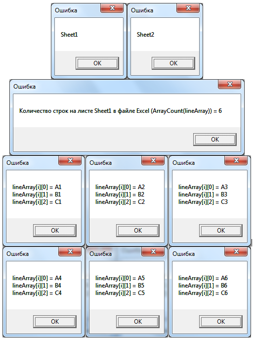

# Чтение данных из файла Excel
***

Чтение данных из файла Excel - очень полезная процедура, позволяющая быстро ввести исходные данные в систему. В настоящем разделе рассмотрим подробно процесс загрузки данных из файла Excel в систему WebTutor.

Предварительно скачайте [файл Excel](Excel-TestFile01.xlsx) для загрузки.

Скопируйте приведенный код в созданный нами агент **Тестовый агент** на вкладку **"Выполняемый код"** (предыдущий код, введенный ранее на эту вкладку, можно удалить) и запустите агент, нажав на кнопку **Выполнить агент на стороне клиента**.

После запуска программы загрузите скачанный ранее файл **Excel-TestFile01.xlsx**.

    // Нажмите кнопку Выполнить агент на стороне клиента и выберите файл Excel.
    // Файл Excel должен быть закрыт.
    excelFileUrl = Screen.AskFileOpen( '', 'Выберите файл&#09;*.*' );
    try
    {
    	sourceList = OpenDoc(excelFileUrl, 'format=excel' );
     	// Загружаются все данные, имеющиеся в файле Excel.

     	workbook = sourceList.TopElem;
     	// workbook - это одномерный массив данных по листам книги Excel.
     	// Данные каждого элемента массива workbook (каждого листа), в свою очередь, организованы в двумерный массив.

     	// Просмотрим наименования загруженных листов
    	for (_sheet in workbook)
    	{
    		alert(_sheet.name);
     	}

    	// Работаем с данными из первого загруженного листа
    	lineArray = sourceList.TopElem[0];
     	// sourceList.TopElem[0] - это то же самое, что и ArrayFirstElem(sourceList.TopElem)
    	// В память загружается двумерный массив данных lineArray[][].
     	// Первый параметр массива - номер столбца (от 0: номер 0 - строка 1; номер 1 - строка 2; номер 2 - строка 3 и т.д.).
    	// Второй параметр массива - номер строки (от 0: номер 0 - столбец A; номер 1 - столбец B; номер 2 - столбец C и т.д.).
    }
    catch(err)
    {
    	alert("ОШИБКА: невозможно получить доступ к файлу " + excelFileUrl + ".");
    	alert("Агент завершен аварийно.");
    	return;
    } 

    alert("Количество строк на листе " + sourceList.TopElem[0].name + " в файле Excel (ArrayCount(lineArray)) = " 
		+ ArrayCount(lineArray) );

    // Вывод информации из столбцов A, B и С первого листа на экран (6 строк)
    for (i = 0; i < ArrayCount(lineArray); i++)
    {
    	alert("lineArray[i][0] = " + lineArray[i][0] + "\n" + 
    		"lineArray[i][1] = " + lineArray[i][1] + "\n" + 
    		"lineArray[i][2] = " + lineArray[i][2] );
    }

---

Результат выполнения агента:

Внесите изменения в загружаемый файл Excel и понаблюдайте, как это повлияет на полученный результат.

Для закрепления понимания программы загрузите данные не с первого, а со второго листа.

---

## Чтение данных из листа с именем Sheet2 в файле Excel

Теперь мы будем загружать данные не с первого листа, а с листа, который имеет наименование **Sheet2**.

Скопируйте приведенный код в созданный нами агент **Тестовый агент** на вкладку **"Выполняемый код"** (предыдущий код, введенный ранее на эту вкладку, можно удалить) и запустите агент, нажав на кнопку **Выполнить агент на стороне клиента**.

	// Нажмите кнопку Выполнить агент на стороне клиента и выберите файл Excel.
	// Файл Excel должен быть закрыт.

	// Указываем название листа, с которого будут считаны данные (оно будет храниться в текстовой переменной WORKSHEET).
	WORKSHEET = 'Sheet2';
	excelFileUrl = Screen.AskFileOpen( '', 'Выберите файл&#09;*.*' );
	try
	{
		sourceList = OpenDoc(excelFileUrl, 'format=excel' );
		// Загружаются все данные из файла Excel.

		workbook = sourceList.TopElem;
		// workbook - это одномерный массив данных по листам книги Excel.
		// Данные каждого элемента массива workbook (каждого листа), в свою очередь, организованы в двумерный массив.
	}
	catch(err)
	{
		alert("ОШИБКА: невозможно получить доступ к файлу " + excelFileUrl + ".");
		alert("Агент завершен аварийно.");
		return;
	}

	worksheet = undefined;
	// Производится просмотр наименований загруженных листов и поиск нужного листа 
	for (_sheet in workbook)
	{
		alert(_sheet.name);
		if (_sheet.name == WORKSHEET)	
		{
			alert("Лист " + WORKSHEET + " найден");
			worksheet = _sheet;
			// Выход из цикла поиска нужного листа
			break;
		}
	}

	// Если лист не найден...
	if (worksheet == undefined)
	{
		alert("ОШИБКА: Рабочий лист [" + WORKSHEET + "] не найден");
		// Выход из агента
		return;
	}

	// Теперь worksheet - это искомый двумерный массив данных на листе Sheet2
	alert("Количество строк на листе " + worksheet.name + " в файле Excel (ArrayCount(worksheet)) = " 
        	    + ArrayCount(worksheet));

	// Вывод информации из столбцов A, B и С указанного листа на экран (4 строк)
	for (i = 0; i < ArrayCount(worksheet); i++)
	{
		alert("worksheet[i][0] = " + worksheet[i][0] + "\n" + 
			"worksheet[i][1] = " + worksheet[i][1] + "\n" + 
			"worksheet[i][2] = " + worksheet[i][2] );
	}

---

Результат выполнения агента:

Внесите изменения в программу и в загружаемый файл Excel и понаблюдайте, как это повлияет на полученный результат.

***

<dd><li> <a href="5_practical_realization.md"> Возврат к части 5</a></dd>

<dd><li> <a href="README.md"> Возврат к оглавлению</a></dd>
