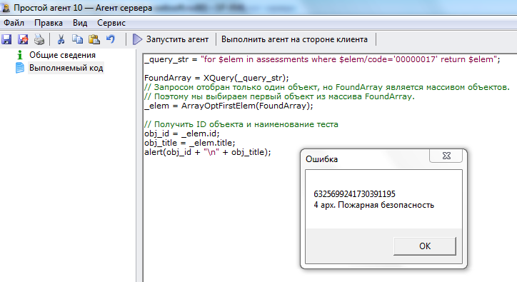

# Поиск теста
***

Для программной реализации поиска теста по коду выполните следующие действия:

1. Сформируйте текст запроса:

**for $elem in assessments where $elem/code='0000017' return $elem**

**Внести изменения!** Обратите внимание, что в данный запрос нужно вставить код реального теста из Вашей базы (код теста можно найти на карточке теста, на вкладке **Общие сведения** в поле **Код**).

2. Проверьте корректность запроса, как это описано в разделе [Тестирование запроса в режиме просмотра каталога](XQuery_control.md).

3. Если запрос сформирован корректно и был найден один нужный сотрудник, скопируйте приведенный код в созданный нами агент **Тестовый агент** на вкладку **"Выполняемый код"** (предыдущий код, введенный ранее на эту вкладку, можно удалить) и запустите агент, нажав на кнопку **Выполнить агент на стороне клиента**.

На карточку агента вводится следующий код:

    _query_str = "for $elem in assessments where $elem/code='00000017' return $elem";

    FoundArray = XQuery(_query_str);
    // Запросом отобран только один объект, но FoundArray является массивом объектов.
    // Поэтому мы выбираем первый объект из массива FoundArray.
    _elem = ArrayOptFirstElem(FoundArray);

    // Получить ID объекта и наименование теста
    obj_id = _elem.id;
    obj_title = _elem.title;
    alert(obj_id + "\n" + obj_title);

---

Результат выполнения агента:

---

Для лучшего усвоения материала измените код и понаблюдайте, как это повлияло на полученный результат.

***

<dd><li> <a href="6_practical_realization.md"> Возврат к части 6</a></dd>

<dd><li> <a href="README.md"> Возврат к оглавлению</a></dd>
