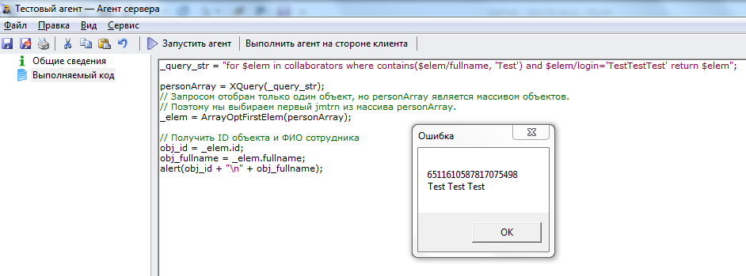

# Поиск сотрудника
***

Для программной реализации поиска сотрудника по фамилии и логину выполните следующие действия:

1. Сформируйте текст запроса:

**for $elem in collaborators where contains($elem/fullname, 'Test') and $elem/login='TestTestTest' return $elem**

2. Проверьте корректность запроса, как это описано в разделе [Тестирование запроса в режиме просмотра каталога](XQuery_control.md).

3. Если запрос сформирован корректно и был найден один нужный сотрудник, скопируйте приведенный код в созданный нами агент **Тестовый агент** на вкладку **"Выполняемый код"** (предыдущий код, введенный ранее на эту вкладку, можно удалить) и запустите агент, нажав на кнопку **Выполнить агент на стороне клиента**.

    _query_str = "for $elem in collaborators where contains($elem/fullname, 'Test') and $elem/login='TestTestTest' return $elem";
    personArray = XQuery(_query_str);
    // Запросом отобран только один объект, но personArray является массивом объектов.
    // Поэтому мы выбираем первый jmtrn из массива personArray.
    _elem = ArrayOptFirstElem(personArray);
    
    // Получить ID объекта и ФИО сотрудника
    obj_id = _elem.id;
    obj_fullname = _elem.fullname;
    alert(obj_id + "\n" + obj_fullname);

---

Результат выполнения агента:

---

Для лучшего усвоения материала измените код и понаблюдайте, как это повлияло на полученный результат.

***

<dd><li> <a href="5_practical_realization.md"> Возврат к части 5</a></dd>

<dd><li> <a href="README.md"> Возврат к оглавлению</a></dd>
