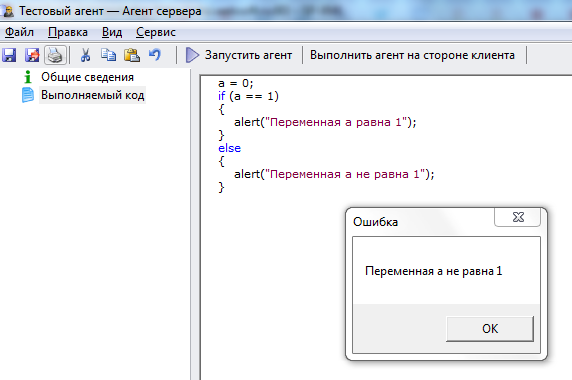
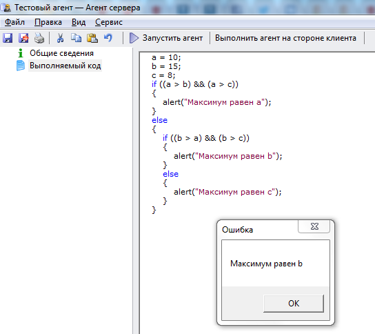

# Создаем первый агент с условным оператором if
***

Условный оператор **if** имеет следующую структуру:

    if (условие)
    {
		// Операторы, выполняемые при выполнении условия
    } 
    else
    {
		// Операторы, выполняемые при невыполнении условия
    }

---

Пример использования оператора **if**:

Скопируйте приведенный код в созданный нами агент **Тестовый агент** на вкладку **"Выполняемый код"** (предыдущий код, введенный ранее на эту вкладку, можно удалить) и запустите агент, нажав на кнопку **Выполнить агент на стороне клиента**.

    a = 0;
    if (a == 1)
    {
		alert("Переменная a равна 1");
    } 
    else
    {
		alert("Переменная a не равна 1");
    }

---

Результат выполнения агента:

Изменяйте значение переменной **a** и понаблюдайте, как это влияет на полученный результат.

---

## Использование вложенного оператора if

Пример использования вложенного оператора **if** - определение максимума значений трех переменных:

Скопируйте приведенный код в созданный нами агент **Тестовый агент** на вкладку **"Выполняемый код"** (предыдущий код, введенный ранее на эту вкладку, можно удалить) и запустите агент, нажав на кнопку **Выполнить агент на стороне клиента**.

    a = 10;
    b = 15;
    c = 8;
    if ((a > b) and (a > c))
    {
		alert("Максимум равен a");
    } 
    else
    {
		if ((b > a) and (b > c))
        	{
			alert("Максимум равен b");
        	}
        	else 
        	{
			alert("Максимум равен c");
        	}
    }
    
---

Результат выполнения агента:

Изменяйте значения переменных **a**, **b** и **c** и понаблюдайте, как это влияет на полученный результат.

***

<dd><li> <a href="1_language.md"> Возврат к части 1</a></dd>

<dd><li> <a href="README.md"> Возврат к оглавлению</a></dd>
