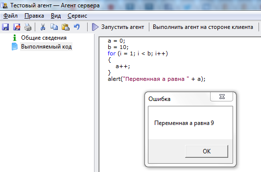

# Цикл for 

Оператор цикла **for** имеет следующую структуру:

for (Counter = Start; Counter < End; Counter++)
{
	// операторы 
} 

где: 
Counter - любая численная переменная VBA
Start - любое численное выражение, определяет начальное значение для переменной counter
End - численное выражение, определяет конечное значение для переменной counter

---

Пример использования оператора **for**:

Скопируйте приведенный код в созданный нами агент **Тестовый агент** на вкладку **"Выполняемый код"** (предыдущий код, введенный ранее на эту вкладку, можно удалить) и запустите агент, нажав на кнопку **Выполнить агент на стороне клиента**.

    a = 0;
    b = 10;
    for (i = 1; i < b; i++)
    {
    	a++;
    }
    alert("Переменная a равна " + a);

---

Результат выполнения агента:

Изменяйте значение переменной **a** и понаблюдайте, как это влияет на полученный результат.

***

<dd><li> <a href="1_language.md"> Возврат к части 1</a></dd>

<dd><li> <a href="README.md"> Возврат к оглавлению</a></dd>
