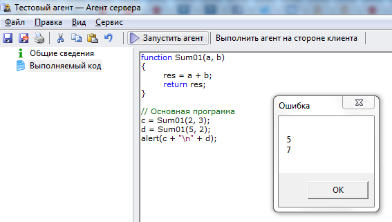

# Пользовательские функции
***

Пользовательская функция **function** имеет следующую структуру:

    function НаименованиеФункции(параметр1, параметр2)
    {
    	// операторы 
     
      	// возвращаемое значение
      	return результат;
    }

Ссылка на функцию в программе:

    a = НаименованиеФункции(значение_параметра1, значение_параметра2)

---

Пример использования функции **function**:

Скопируйте приведенный код в созданный нами агент **Тестовый агент** на вкладку **"Выполняемый код"** (предыдущий код, введенный ранее на эту вкладку, можно удалить) и запустите агент, нажав на кнопку **Выполнить агент на стороне клиента**.

    function Sum01(a, b)
    {
    	res = a + b;
    	return res;
    }
    
    // Основная программа
    c = Sum01(2, 3);
    d = Sum01(5, 2);
    alert(c + "\n" + d);

 ---

Результат выполнения агента:

Изменяйте значения переменных **a** и **b** и понаблюдайте, как это влияет на полученный результат.

***
<dd><li> <a href="1_language.md"> Возврат к части 1</a></dd>
<dd><li> <a href="README.md"> Возврат к оглавлению</a></dd>
