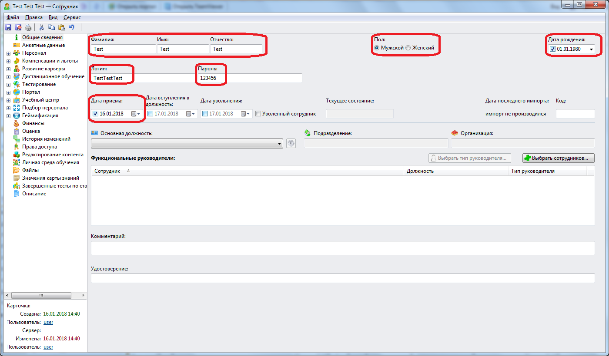
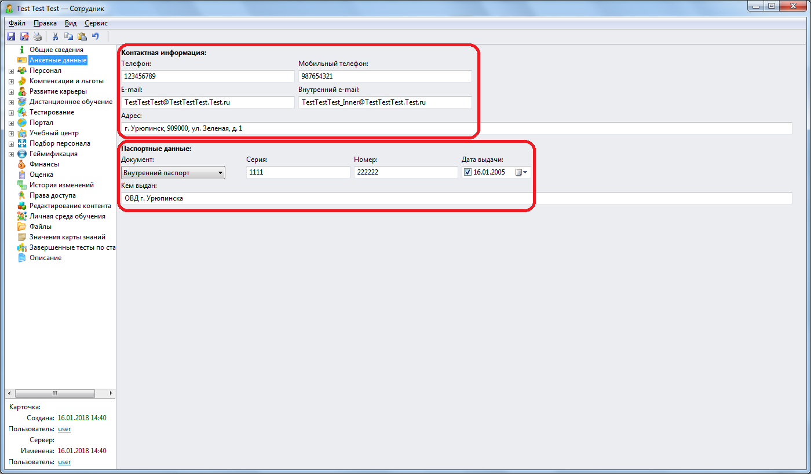

# Приложение. Почему я не могу найти тестового сотрудника?
***

Тестовый сотрудник создавался в данном практикуме в [разделе](collaborator1.md). 

Если Вы не находите тестового сотрудника, то, скорее всего, Вы пропустили создание этой учетной записи.

В таком случае необходимо добавить тестового сотрудника.
Заполните поля карточки тестового сотрудника, как это показано на двух следующих скриншотах:

**Внимание!** В качестве электронного адреса нужно ввести несуществующий адрес, так как на данный адрес может быть направлены сообщения системы WebTutor.

***
<dd><li> <a href="README.md"> Возврат к оглавлению</a></dd>
