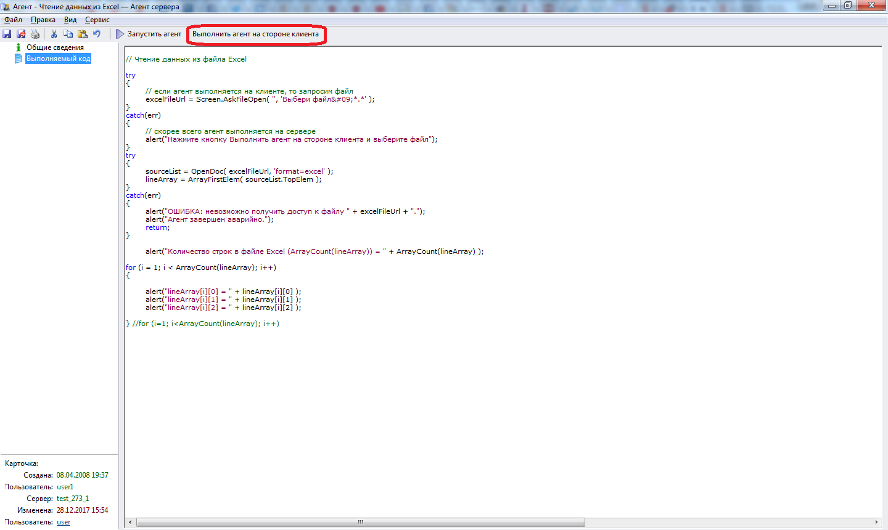

# Как запустить агент? 
***

Мы будем запускать агент следующим образом:

- Открываем карточку агента (напоминаю, что все агенты в системе размещаются в WebTutor Administrator в разделе **Дизайнер - Агенты сервера**).

- На вкладку **"Выполняемый код"** записываем или копируем из настоящего пособия выполняемый код.

- Нажимаем кнопку **Выполнить агент на стороне клиента**.

---

**Примечание** - В принципе агент можно запускать с сервера (кнопка **Запустить агент**) и с клиента (кнопка **Выполнить агент на стороне клиента**). Мы, чаще всего, будем запускать агент на стороне клиента. В этом режиме действует команда **alert**, выводдящая на экран окно с информацией, чем мы будем активно пользоваться во многих упражнениях.
 

***

<dd><li> <a href="README.md"> Возврат к оглавлению</a></dd>
