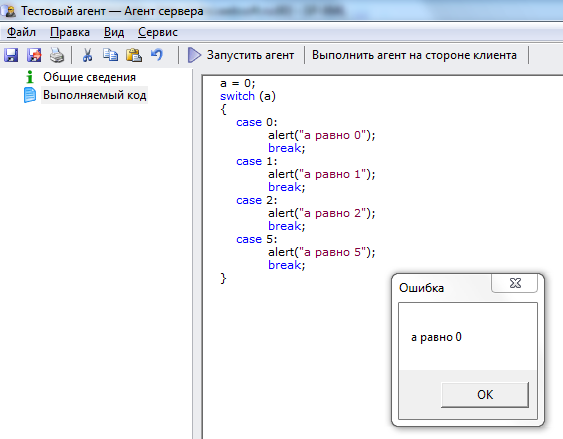

# Оператор выбора switch
***

Оператор выбора **switch** имеет следующую структуру:

    switch(переменная)
    {    
    	case 'значение 1':
    		// операторы 
    		break;
    	case 'значение 2':
    		// операторы 
    		break;
    	case 'значение 3':
    		// операторы 
    		break;
    	...
        case default:
    		// операторы 
    		break;
    }

---

Пример использования оператора **switch**:

Скопируйте приведенный код в созданный нами агент **Тестовый агент** на вкладку **"Выполняемый код"** (предыдущий код, введенный ранее на эту вкладку, можно удалить) и запустите агент, нажав на кнопку **Выполнить агент на стороне клиента**.

    a = 0;
    switch (a)
    {
    	case 0:
    		alert("a равно 0"); 
    		break;
    	case 1:
    		alert("a равно 1"); 
    		break;
    	case 2:
    		alert("a равно 2"); 
    		break;
    	case 5:
    		alert("a равно 5"); 
    		break;
    } 

---

Результат выполнения агента:

Изменяйте значение переменной **a** и понаблюдайте, как это влияет на полученный результат.

 

***

<dd><li> <a href="1_language.md"> Возврат к части 1</a></dd>
<dd><li> <a href="README.md"> Возврат к оглавлению</a></dd>
