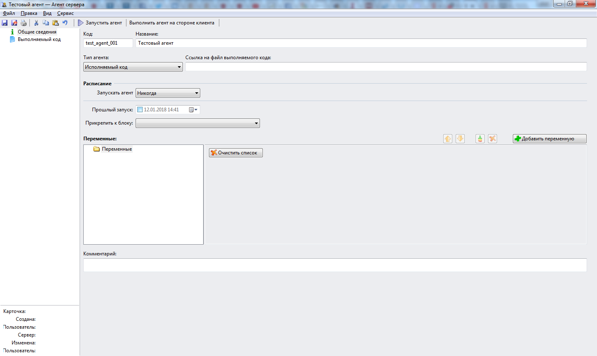

# Создание тестового агента для выполнения практических занятий
***

Откройте в WebTutor Administrator раздел **Агенты сервера**, как это было описано на странице ["Что такое агент?"](agent.md).

Далее нажмите на кнопку **Новая запись**. Откроется пустая карточка нового агента.

Введите на вкладке **"Общие сведения"** код агента **test_agent_001** и название **Тестовый агент**. Другие данные пока вводить не нужно. 

Сохраните изменения .

Для того, чтобы увидеть на вкладке **Агенты сервера** добавленный в систему тестовый агент, откройте эту вкладку и нажмите на кнопку **F5** для обновления представления перечня агентов. 

**Внимание!** Обратите внимание на то, чтобы код этого агента был уникальным. Если в системе уже имеется агент с данным кодом, то укажите для него другой (уникальный) код. 

В дальнейшем мы будем в основном выполнять упражнения в этом агенте.

Вкладку **"Выполняемый код"** мы пока не заполняем.

***

<dd><li> <a href="README.md"> Возврат к оглавлению</a></dd>
